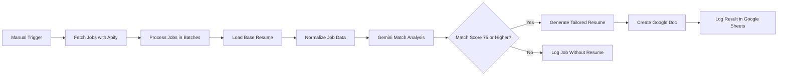

# AI Job Triage & Resume Builder

An n8n workflow that evaluates job postings against a base resume and generates a tailored resume for high-matching opportunities.

## How to Use

The workflow:

1. Fetches job postings through Apify.
2. Loads a base resume from Google Docs.
3. Uses Gemini to compare the resume with each job description.
4. Assigns a match score and recommends `APPLY`, `REVIEW`, or `SKIP`.
5. Generates a tailored resume when the match score is 75 or higher.
6. Saves job results and resume links to Google Sheets.

## Setup Steps

### 1. Import the Workflow

Import the workflow JSON file into n8n.

### 2. Connect Your Accounts

Connect the following credentials:

* Apify
* Google Docs
* Google Sheets
* Gemini
* OpenAI

### 3. Replace the Google File Settings

Update the workflow with your own:

* Base resume Google Doc
* Resume destination folder
* Job-tracker spreadsheet
* Worksheet name

### 4. Prepare Google Sheets

Create these headers in the first row:

```text
jobKey
runAt
title
company
location
workplaceType
postedDate
url
matchScore
action
oneLineRationale
mustHaveHits
mustHaveMisses
riskFlags
resumeDocId
resumeDocUrl
```

### 5. Configure the Job Search

Open the Apify node and update:

* Job titles
* Location
* Employment type
* Experience level
* Workplace type
* Maximum number of jobs

### 6. Run the Workflow

Start the workflow using the manual trigger.

Jobs with a match score of 75 or higher will receive a customized resume. Lower-scoring jobs will only be logged in Google Sheets.

## Workflow



## Disclaimer

This workflow is an educational and portfolio project.

AI-generated scores and resumes may contain errors and should always be reviewed before use. The workflow does not guarantee interviews or employment.

Automated collection of job-posting data may be restricted by a website’s terms of service. Users are responsible for reviewing applicable platform rules, privacy requirements, and local laws.

Do not publish API keys, credentials, personal document IDs, spreadsheet IDs, or folder IDs in a public GitHub repository.
